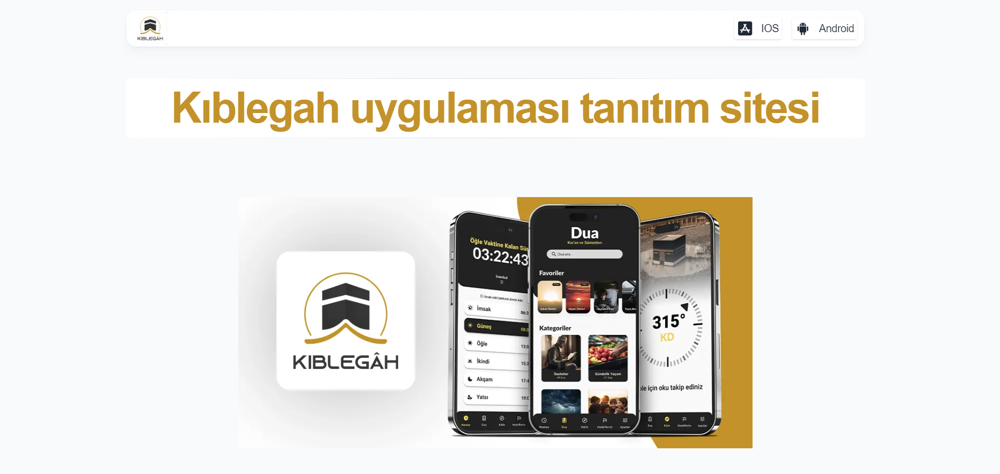
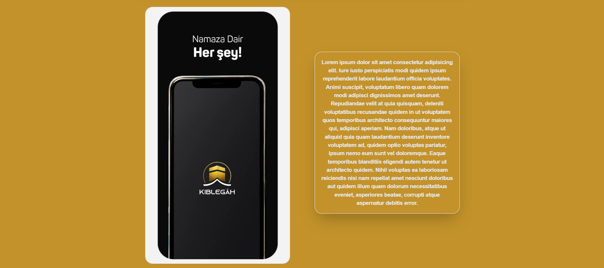
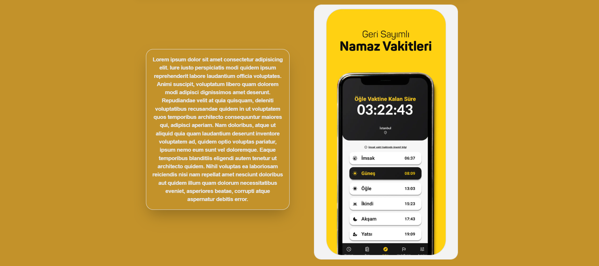
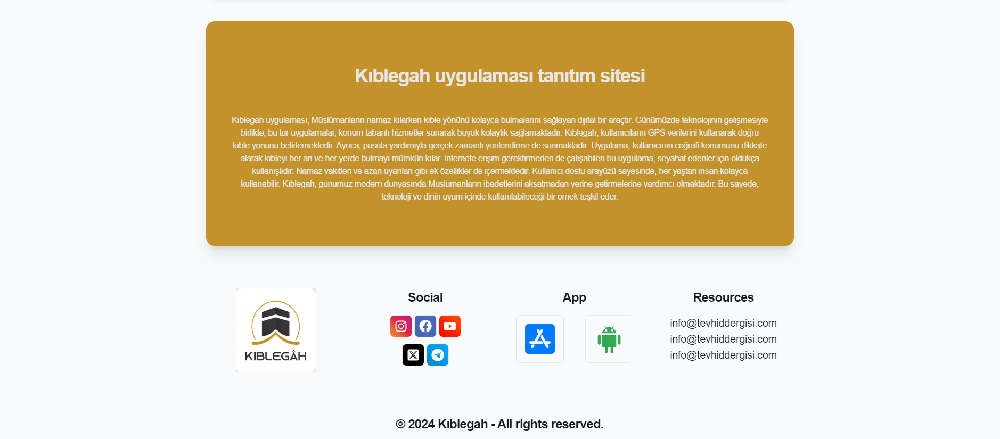

# Kıblegah uygulaması tanıtım sitesi 

    <h1>Anasayfa</h1>
    
     
     
    <h1>Uygulama Açıklaması 1</h1>
    
     
     
    <h1>Uygulama Açıklaması 2</h1>
    
     
     
    <h1>Alt bilgi</h1>
    
     
     
     
     
     

# Kullanılan Teknolojiler

-  **HTML**

-  **CSS**

-  **Javascript**

-  **Typescript**

-  **React JS**

-  **Tailwind CSS**

-  **JSON**

-  **API**
